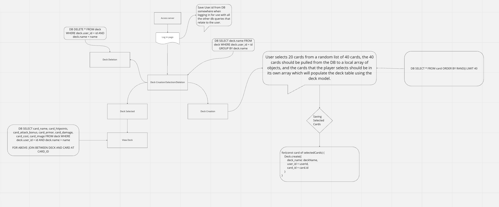

# Monster-Fighter
A card-based fighting game with D&amp;D monsters!

## Table of Contents
1. [Description](#description)
2. [GitHub](#github-repo-link)
3. [Heroku](#heroku-deployment-link)
4. [Browser](#browser-support)
5. [Built With](#built-with)
6. [APIs](#apis)
7. [Development](#development)
8. [Authors](#authors)
9. [Sources](#sources)
10.[License](#license)

## Description
A PVP deck building and monster card battle game where you can fight your friends, your enemies, or a random person online.  Log into the game on the landing page, build your first deck from an assortment of over 300 cards and then take it to the battleground to test your skill and luck.

### Github Repo link
https://github.com/awoelf/monster-fighter

### Heroku Deployment link
https://group11-monster-fighter.herokuapp.com/

### Browser support
Chrome

## Built With
1. Firebase & Friestore - Chat functionally 
2. HTML, CSS, JavaScript
3. Handlebars - Template engine
4. Bootstrap - CSS Framework
5. VS Code

## APIs
1. D&D Monster Database - https://www.dnd5eapi.co/
2. Dice API - https://lets-role.wiki/Dice_API
3. Pixelate images - https://github.com/giventofly/pixelit
4 .Background images - https://www.pexels.com/api/

## Development 
Monster Fighter line up
https://docs.google.com/document/d/124t18icMxqRooAdwixC9HjvmSyH8-GCY6qC2acWBN4Q/edit?usp=sharing

Game and user flow diagram

## Authors

* Cody - @krimeas
* Alexis - @awoelf
* Allen - @allenwang1999
* JaMionn - @osheathe1

## Sources
Chat:
1. Firebase Firestore Tutorial #7 - Ordering Data - https://www.youtube.com/watch?v=cb8H_hp10rc&list=RDCMUCW5YeuERMmlnqo4oq8vwUpg&index=3

2. Firebase Back to the Basics - https://www.youtube.com/watch?v=q5J5ho7YUhA&list=RDLVrQvOAnNvcNQ&index=4

3. How to Build a Chat App - https://www.cometchat.com/tutorials/how-to-build-a-chat-app-with-firebase

## License
MIT 
